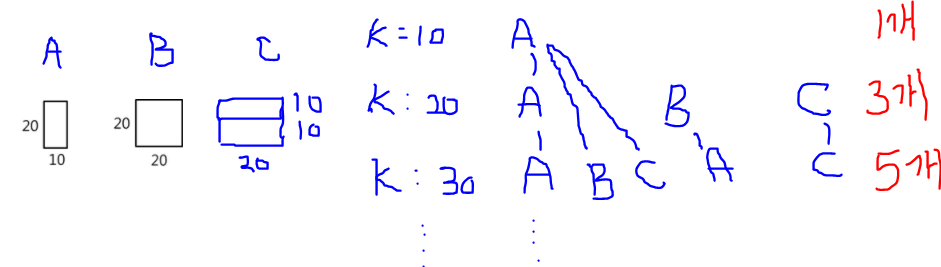

# Algorithm 문제 풀이 및 정리

> 첫 알고리즘 수업 시간에 느꼈던 점은 너무 너무 어렵다,,그저 어렵다,,였다. 문제를 풀기 위한 알고리즘을 생각하는 것도 부족하고 배웠던 Python 문법을 적용시켜 구현하는 것은 더욱 어려웠다.

> 때문에!!!! Algorithm 수업 시간에 배운 이론 내용과 풀었던 문제를 다시 정리하고 swea 문제들을 풀어보며 내 것으로 만들기위해 레포지를 만들었다!!

> 문제를 못 풀수도 있고 풀었다하더라도 코드의 길이가 길고 실행시간이 오래 걸리는 등 아직 많이 부족하기 때문에 두번, 세번 풀어보며 코드를 간소화해보자.

> 또한, 함께 수업을 듣는 사람들과 소통하며 다양한 코드 구현 방식을 익혀보자! 화이팅!! 😊😊


> ▶ 사용할 언어: Python 
>
> ▶ SW 역량테스트 IM 도저언!
>
> ▶ 1일 1 커밋하기!
>
> ▶ SWEA : 문제 난이도 > swea_문제번호 
>
> ▶ Algorithm: 난이도 > 문제 유형 > 문제번호_문제제목


---


[toc]

---


## SWEA

### D1


### D2

- **swea_1966 (숫자를 정렬하자)**

주어진 N의 길이의 숫자열을 오름차순으로 정렬하여 출력하는 문제.

수업시간에 배웠던 선택정렬을 사용!

```python
T = int(input())
for tc in range(1, T+1):
    N = int(input())
    lst = list(map(int, input().split()))
    for i in range(N): # 주어진 N의 범위만큼 순회
        min = i # i가 0부터 시작하므로 최솟값을 찾기 위한 인덱스 min을 i로 설정
        for j in range(i+1, N): # 0 다음인 1 인덱스부터 차례대로 순회
            if lst[min] > lst[j]: # 0번째 값보다 작은 인덱스 값(j)이 나온다면
                min = j # 최소 인덱스 값을 j로 바꿔준다.
        lst[i], lst[min] = lst[min], lst[i] # 현재 인덱스와 최소 인덱스 자리를 swap!
    
    print('#{}'.format(tc), end=' ')
    for i in lst: 
        print(i, end=' ')
    print()
```


- **swea_1948 (날짜 계산기)**

월 일로 이루어진 날짜를 2개 입력 받아, 두 번째 날짜가 첫 번째 날짜의 며칠째인지 출력하는 문제.

나는 날짜 계산법의 정석대로 그냥 풀었다..

```python
T = int(input())
for tc in range(1, T+1):

    lst = list(map(int, input().split())) # 3 22 5 10
	# 각 월마다 날짜 수를 리스트로 만들어준다.
    # 3월 22일에서 5월 10일까지의 날짜를 계산하려면
    # 3월 22일~3월 31일/ 4월 / 5월 1일~5월 10일의 일 수를 다 더해준다.
    num = [31, 28, 31, 30, 31, 30, 31, 31, 30, 31, 30, 31]
    total = 0
    # 먼저 통으로 계산되는 월을 구해서 total에 더해주고 (4월)
    for i in num[lst[0]:lst[2]-1]:
        total += i
	# 두 날짜의 월이 같다면 두 날짜의 일을 뺀 값을 더해주고
    if lst[0] == lst[2]:
        total += (lst[3] - lst[1])
    # 같지않다면
    # 첫번째 날짜의 경우, 해당 월의 총 일수에서 현 날짜를 빼준다(첫번째 날짜가 3월 22일이라면       3월의 총 일수인 31에서 현 일수인 22일을 빼 8이 얻어진다.)
    # 두번째 날짜의 경우, 그냥 현 일수인 lst[3]의 값을 더해주면 된다.(5월 10일이라면 그냥         10만 더해준다.)
    else: 
        total += (num[lst[0]-1] - lst[1]) + lst[3]
        #두번째 날짜가 첫번째 날짜의 며칠째인지 묻고 있으므로 총 total에 1을 더해준다.
    print('#{} {}'.format(tc, total+1))
```


- **swea_1961 (숫자 배열 회전)**

N x N 행렬이 주어질 때,

시계 방향으로 90도, 180도, 270도 회전한 모양을 출력하는 문제.

나는 행 순서가 아니라 열 순서대로 숫자들을 거꾸로 새로운 리스트에 담는 방법을 사용했다.


만일 N이 3이라면,

new_arr = [ 

[arr[2] [0], arr[1] [0], arr[0] [0]], 

[arr[2] [1], arr[1] [1], arr[0] [1]], 

[arr[2] [2], arr[1] [2], arr[0] [2]]

]


이렇게 일일이 하니 시간이 너무 오래 걸렸고 코드가 엄청 길어졌다..

코드를 줄이는 방법을 다시 생각해야겠다,,

```python
T = int(input())
for tc in range(1, T+1):
    N = int(input())
    arr = [list(map(int, input().split())) for _ in range(N)]

    new_lst = []
    for i in range(0, len(arr)):
        lst = []
        for j in range(0, len(arr)):
            lst.append(arr[j][i])
            
        new_lst.append(lst)
        
    num_list = []
    for i in new_lst:
        num_list.append(i[::-1])

    new_lst2 = []
    for k in range(0, N):
        lst2 = []
        for l in range(0, N):
            lst2.append(num_list[l][k])
        new_lst2.append(lst2)

    num_list2 = []
    for i in new_lst2:
        num_list2.append(i[::-1])
        num_list.append(i[::-1])

    new_lst3 = []
    for k in range(0, N):
        lst3 = []
        for l in range(0, N):
            lst3.append(num_list2[l][k])
        new_lst3.append(lst3)

    num_list3 = []
    for i in new_lst3:
        num_list3.append(i[::-1])
        num_list.append(i[::-1])

    print('#{}'.format(tc))
    for i in range(0, N):
        for j in num_list[i:len(num_list):N]:
            j.append(" ")
            for k in j:
                print(k, end='')
        print()
```


- **swea_1979 (어디에 단어가 들어갈 수 있을까)**

처음엔 행과 열 모두 체크하면서 연속된 1의 값을 cnt로 체크해주고 cnt가 K-1번 나왔다면 result에 +1을 해주자! 라고 생각하고 코드를 짰다.

```python
N, K = map(int, input().split())
arr = [list(map(int, input().split())) for _ in range(N)]

result = 0
# 행 체크
for i in range(0, N):
    cnt = 0
    for j in range(0, N-1):
        if arr[i][j] == 0:
            continue
        else:
            if arr[i][j] == arr[i][j+1]:
                cnt += 1
if cnt == K-1:
    result += 1
# 열 체크
for i in range(0, N-1):
    cnt1 = 0
    for j in range(0, N):
        if arr[j][i] == 0:
            continue
        if arr[j][i] == arr[j][i+1]:
            cnt1 += 1
if cnt1 == K-1:
    result += 1
print(result)
```

여기서 가장 쉽게 발견할 수 있었던 오류는 cnt와 K-1의 if문의 들여쓰기 였다.

그래서 일일이 if문 들여쓰기를 해보았다.


```python
N, K = map(int, input().split())
arr = [list(map(int, input().split())) for _ in range(N)]

result = 0

for i in range(0, N):
    cnt = 0
    for j in range(0, N-1):
        if arr[i][j] == 0:
            cnt = 0
            continue
        if arr[i][j] == arr[i][j+1]:
            cnt += 1
    if cnt == K-1:
    	result += 1
                
for i in range(0, N-1):
    cnt1 = 0
    for j in range(0, N):
        if arr[j][i] == 0:
            cnt1 = 0
            continue         
        if arr[j][i] == arr[j][i+1]:
            cnt1 += 1
    if cnt1 == K-1:
    	result += 1

print(result)
```

연속된 값으로 찾으려고 했는데 답이 안나와서 그냥 요소가 1인것들을 세기로 했다.

```python
N, K = map(int, input().split())
arr = [list(map(int, input().split())) for _ in range(N)]

result = 0
for i in range(0, N):
    cnt = 0
    for j in range(0, N):
        if arr[i][j] == 0:
            cnt = 0
            continue
        if arr[i][j] == 1:
            cnt += 1
    if cnt == K:
        result += 1    

for i in range(0, N):
	cnt1 = 0
	for j in range(0, N):
		if arr[j][i] == 0:
			cnt1 = 0
			continue
		if arr[j][i] == 1:
			cnt1 += 1
	if cnt1 == K:
		result += 1
```

이렇게 하면 행 또는 열 안에 1이 연속되게 K번 나온 후 0이 나온다면 cnt를 0으로 초기화했기 때문에 값이 나오지 않았다. 그래서 요소가 0일 때도 cnt가 K와 같은지 확인해야 한다!

> 최종코드

```python
import sys
sys.stdin = open('input_1979.txt')

T = int(input())
for tc in range(1, T+1):

    N, K = map(int, input().split())
    arr = [list(map(int, input().split())) for _ in range(N)]

    result = 0
    # cnt = 0
    for i in range(0, N):
        cnt = 0
        for j in range(0, N):
            if arr[i][j] == 0:
                if cnt == K:
                    result += 1
                cnt = 0
                continue
            else:
                cnt += 1
        if cnt == K:
            result += 1

    for i in range(0, N):
        cnt = 0
        for j in range(0, N):
            if arr[j][i] == 0:
                if cnt == K:
                    result += 1
                cnt = 0
                continue
            else:
                cnt += 1
        if cnt == K:
            result += 1

    print('#{} {}'.format(tc, result))
```


- **swea_1976 (시각 덧셈)**

시 분으로 이루어진 시각을 2개 입력 받아, 더한 값을 시 분으로 출력하는 문제.

```python
T = int(input())
for tc in range(1, T+1):

    lst = list(map(int, input().split()))

	# 시 끼리 먼저 더해주고 더한 값이 12보다 크면 값에서 12를 빼준다.
    if lst[0] + lst[2] > 12:
        h = (lst[0] + lst[2]) - 12

    else:
        h = lst[0] + lst[2]
	# 분 끼리 더해주고 더한 값이 60보다 크면 값에서 60을 빼주고 시에 + 1를 해준다.
    if lst[1] + lst[3] > 60:
        h += 1
        m = (lst[1] + lst[3]) - 60

    else:
        m = lst[1] + lst[3]

    print('#{} {} {}'.format(tc,h, m))
```


- **swea_1954 (달팽이 숫자)**

1부터 N*N 까지의 숫자를 시계방향으로 이루어진 달팽이 모양으로 출력하는 문제.

```python
T = int(input())
for tc in range(1, T+1):

    # lst에서 최소값을 구한다.
    def getMin(curV):
        minV = 1000
        for i in lst:
            if minV > i and i > curV:
                minV = i
        return minV

    # 벽을 만났을 때,
    def isWall(x, y):
        if x >= N or x < 0:
            return True
        if y >= N or y < 0:
            return True
        if arr[y][x] != 0:
            return True
        return False

    N = int(input())
    lst = list(range(1, N**2+1))
    arr = [[0] * N for _ in range(N)]
    
	# 방향 설정
    dx = [1, 0, -1, 0]
    dy = [0, 1, 0, -1]
    dir = 0

    # 현재 위치 설정
    curX = curY = 0
    curV = 0
	
    for i in range(1, N**2+1):
        val = getMin(curV)
        arr[curY][curX] = val
        testX = curX + dx[dir]
        testY = curY + dy[dir]
        if isWall(testX, testY):
            dir += 1
            if dir == 4:
                dir = 0

        curX = curX + dx[dir]
        curY = curY + dy[dir]
        curV = val

    print('#{}'.format(tc))
    for i in range(len(arr)):
        for j in range(len(arr)):
            print(arr[i][j], end=" ")
        print()
```


- **swea_2005 (파스칼의 삼각형)**


```python
T = int(input())
for tc in range(1, T+1):
    
    N = int(input())
    # N행의 빈 2차원 리스트를 만들어준다.
    arr = [ [] for _ in range(N)]

    # 1행은 [1] 2행은 [1, 1]을 먼저 넣어준다.
    arr[0].append(1)
    if len(arr) > 1:
        arr[1].append(1)
        arr[1].append(1)

	# 2행부터 순회하며 연속된 두개의 값을 더해 그 다음 행에 넣어주고,
    for i in range(1, N-1):
        for j in range(0, len(arr[i])-1):
            x = arr[i][j] + arr[i][j+1]
            arr[i+1].append(x)
        # 행의 앞, 뒤로 1를 넣어준다.
        arr[i+1].insert(0, 1)
        arr[i+1].insert(len(arr[i+1]), 1)

    print('#{}'.format(tc))
    for i in range(N):
        for j in range(0, len(arr[i])):
            print(arr[i][j], end=" ")
        print()
```


- **swea_1970 (쉬운 거스름돈)**

```python
T = int(input())
for tc in range(1, T+1):
    N = int(input())
    lst = [50000, 10000, 5000, 1000, 500, 100, 50, 10]

    print('#{}'.format(tc))
    cnt = 0
    for i in lst:
        cnt = N // i
        print(cnt,end=" ")
        N = N - (i*cnt)
    print()
```


- **swea_1926 (간단한 369게임)**


- **swea_1954 (달팽이 숫자)**

```python
# 벽인지 체크
def isWall(x, y):
    if x < 0 or x >= N:
        return True
    if y < 0 or y >= N:
        return True
    if arr[y][x] != 0:
        return True
    return False

T = int(input())
for tc in range(1, T+1):
    print('#{}'.format(tc))
    N = int(input())
    src = list(_ for _ in range(1, N**2 + 1))
    arr = [[0] * N for _ in range(N)]
    # print(src)
    # 방향설정
    dx = [1, 0, -1, 0]
    dy = [0, 1, 0, -1]
    dir = 0
	# 시작점 설정
    curX = curY = 0
	
    # src 에 이미 정렬된 값이 들어있으므로 따로 최소값과 최대값을 안구해도 된다.
    for i in range(0, N**2):
        arr[curY][curX] = src[i]
        testX = curX + dx[dir]
        testY = curY + dy[dir]
        if isWall(testX, testY):
            dir += 1
            if dir == 4:
                dir = 0
        curX = curX + dx[dir]
        curY = curY + dy[dir]

    # print(arr)
    for i in range(N):
        for j in range(N):
            print(arr[i][j], end=" ")
        print()
```


### D3

- **swea_4615 (재미있는 오셀로 게임)**

```python
for tc in range(1, int(input())+1):
    N, M = map(int, input().split())
    arr = [[0] * N for _ in range(N)]
    i = N // 2
    j = i - 1
    arr[i][i] = 2
    arr[j][j] = 2
    arr[i][j] = 1
    arr[j][i] = 1

    for i in range(M):
        x, y, color = map(int, input().split())
        # arr의 인덱스는 0부터 시작하니까 -1을 빼준다.
        x = x - 1
        y = y - 1
        arr[y][x] = color
        # 오른쪽, 왼쪽, 아래, 위, 대각선오른쪽아래, 대각선왼쪽아래, 대각선 오른쪽위, 대각선 왼쪽위
        dx = [1, -1, 0, 0, 1, -1, 1, -1]
        dy = [0, 0, 1, -1, 1, 1, -1, -1]
        for d in range(8):
            newX = x + dx[d]
            newY = y + dy[d]
            # 방향을 이동한 값(오른쪽으로 이동했다면 오른쪽으로 이동한 값)이 현재의 color와 같지 않다면,
            # 현재의 color와 같은 값이 나올때까지 이동
            while newX >= 0 and newY >= 0 and newX < N and newY < N and arr[newY][newX] != 0 and arr[newY][newX] != color:
                newX += dx[d]
                newY += dy[d]
            # 쭉 이동하다가 color가 같은 값을 만났다면,
            # 맨 처음 위치로 다시 되돌아오면서 값을 바꿔준다. ex) 1 2 2 1 -> 1 1 1 1
            if newX >= 0 and newY >= 0 and newX < N and newY < N and arr[newY][newX] == color:
                while newX >= 0 and newY >= 0 and newX < N and newY < N and x != newX or y != newY:
                    newX -= dx[d]
                    newY -= dy[d]
                    arr[newY][newX] = color

    cnt = 0
    cnt1 = 0
    for i in range(N):
        for j in range(N):
            if arr[i][j] == 1:
                cnt += 1
            if arr[i][j] == 2:
                cnt1 += 1
    print('#{} {} {}'.format(tc, cnt, cnt1))
```

#

```python
# donguk
def check(r, c, k, color, idx):
# 놓은자리 바둑돌색깔(color 값은 안바뀜)과 같은색깔 만나면 탈출
    if 0<=r<N and 0<=c<N and brd[r][c]==color:
# 지금까지 지나온 자리 바둑돌 뒤집어준다 내껄로
        for i in range(1, idx+1):
            brd[r - dr[k]*i][c - dc[k]*i] = color
        return
# 한칸 더 가도 상대팀바둑돌이면 1칸 추가해주고 재귀 ㄱㄱ
    if 0<=r<N and 0<=c<N and brd[r][c]==3-color:
        check(r + dr[k], c + dc[k], k, color, idx+1)

dr = [-1,1,0,0, -1,-1,1,1]
dc = [0,0,-1,1, -1,1,-1,1]

T = int(input())
for tc in range(1, T+1):
    N, M = map(int, input().split())
    brd = [[0]*N for _ in range(0, N)]

# 기본위치 바둑돌
    brd[N//2-1][N//2-1] = 2
    brd[N//2][N//2] = 2
    brd[N//2-1][N//2] = 1
    brd[N//2][N//2-1] = 1

    for i in range(0, M):
        c, r, color = map(int, input().split())
# 0,0부터 시작하기로 했으니 1빼주고넣음
        brd[r-1][c-1] = color
        for k in range(0, 8):
            nr = r-1 + dr[k]
            nc = c-1 + dc[k]
# 놓는자리의 8방향중에서 인접한 곳이 다른색 바둑돌(3-1=2, 3-2=1)인 경우 함수 스타트
            if 0<=nr<N and 0<=nc<N and brd[nr][nc]==3-color:
                check(nr, nc, k, color, 0)

    cnt_B = 0
    cnt_W = 0
    for r in range(0, N):
        for c in range(0, N):
            if brd[r][c]==1:
                cnt_B += 1
            elif brd[r][c]==2:
                cnt_W += 1

    print(f'#{tc} {cnt_B} {cnt_W}')
```


---


## Algorithm

### Intermediate

- **[S/W 문제해결 기본] 5일차 (swea_1221) - GNS**

  ```python
  T = int(input())
  for tc in range(1, T+1):
      print('#{}'.format(tc))
      N = input() # 실제 사용은 하지 않는다.
      word = input().split()
      word_list = ["ZRO", "ONE", "TWO", "THR", "FOR", "FIV", "SIX", "SVN", "EGT", "NIN"]
  
      # word_list의 값들이 0~9의 값을 가지도록 딕셔너리 형태로 만들어준다.
      # {'ZRO': 0, 'ONE': 1, 'TWO': 2, 'THR': 3, 'FOR': 4, 'FIV': 5, 'SIX': 6, 'SVN': 7, 'EGT': 8, 'NIN': 9}
      result = {}
      cnt = 0
      for i in word_list:
          if i == "ZRO":
              cnt = 0
          else:
              cnt += 1
          result[i] = cnt
  
      # input값을 오름차순으로 정렬시키기 위해 .get()을 이용하여 value값만 담은 리스트를 만들었다.
      new = []
      for i in word:
          new.append(result.get(i))
          new = sorted(new)
  
      # 정렬된 value값들을 순회하면서,
      # result의 value값과 같다면 key를 출력하도록 하였다.
      key_lst = []
      for num in new:
          for key, value in result.items():
              if value == num:
                  key_lst.append(key)
  
      for i in key_lst:
          print(i, end=" ")
      print()
  ```

  #

  ```python
  arr = ["ZRO", "ONE", "TWO", "THR", "FOR", "FIV", "SIX", "SVN", "EGT", "NIN"]
  T = int(input())
  for tc in range(1, T+1):
      print('#{}'.format(tc))
      No, N = input().split()
      s = input().split()
      # 1번째 방법
      # arr을 순회하면서 값이 s에 있으면 출력하면 된다.
      for chk in arr:
          for j in s:
              if chk == j:
                  print(j, end=" ")
      print()
  ```

  #
  
  ```python
  arr = ["ZRO", "ONE", "TWO", "THR", "FOR", "FIV", "SIX", "SVN", "EGT", "NIN"]
  T = int(input())
  for tc in range(1, T+1):
      print('#{}'.format(tc))
      No, N = input().split()
      s = input().split()
      # 2번째 방법
      # arr을 순회하면서 s에 몇개있는지 count를 센 후, count만큼 출력한다.
      for i in arr:
          print((i+' ')*s.count(i), end=" ")
  ```


- **[S/W 문제해결 기본] 3일차(swea_1216) - 회문2**

```python
'''
100 * 100 table에서 행과 열에서 가장 긴 회문을 찾고 회문의 길이를 출력하는 문제.
회문의 길이가 정해져있지않아 1개부터 100개가지 반복을 돌며 회문을 찾고,
딕셔너리에 key에는 회문을 value에는 회문의 길이를 넣어
value값만 순회하며 최댓값을 찾아냈다.
'''

T = 10
for tc in range(1, T+1):
    print('#{}'.format(tc), end=" ")

    number = int(input())
    arr = list(input() for _ in range(100))
    # 회문과 회문의 길이를 담을 딕셔너리를 만든다.
    result = {}

    # 행 탐색
    # 100 * 100 table이기 때문에 범위를 100으로 주면서 완전탐색한다.
    for i in range(100):
        for j in range(100):
            # 회문의 길이가 1부터 100까지 가능하기때문에 슬라이싱 범위에 사용될 k를 2~101까지 반복을 돌린다.
            for k in range(2, 102):
                # i = 0, j = 0, k = 2라면,
                # arr[0][0:2]까지 슬라이싱한 후 회문인지 판단한다.(k=2 -> 회문의 길이 == 1)
                if arr[i][j:j+k] == arr[i][j:j+k][::-1]:
                    # 회문이라면, 회문의 길이를 구하고
                    length = len(arr[i][j:j+k])
                    # result에 key=회문, value=회문 길이로 넣어준다.
                    result[arr[i][j:j+k]] = length
    # 열 탐색
    # 열은 슬라이싱을 사용할 수 없다.
    # 그러므로 열 값을 따로 담은 리스트를 새로 만들자.

    # 2차원 리스트 변수를 만든다.
    column = []
    # 완전탐색으로 열을 c_lst에 담는다.
    for i in range(100):
        c_lst = []
        for j in range(100):
            c_lst.append(arr[j][i])
        # c_lst를 column리스트에 담아준다.
        # [ [""], [""], [""].... ]
        column.append(c_lst)
    
    # 행과 같은 방법으로 회문을 찾는다.
    for i in range(100):
        for j in range(100):
            for k in range(2, 102):
                if column[i][j:j+k] == column[i][j:j+k][::-1]:
                    length = len(column[i][j:j+k])
                    result["".join(column[i][j:j+k])] = length
    # result의 value 값을 순회하면서 초댓값을 찾아준다.
    max_value = 0
    for key, value in result.items():
        if max_value < value:
            max_value = value
    # 최댓값을 출력한다.
    print(max_value)
```

#

```python
T = 10
for tc in range(1, T+1):
    test_case = int(input())
    str_table = list(input() for _ in range(100))
    trans = list(zip(*str_table))

    max_length = 1
    for i in range(100):
        # 회문의 길이 100부터 
        for m in range(100, 1, -1):
            for j in range(100-m+1):
                if str_table[i][j:j+m] == str_table[i][j:j+m][::-1]:
                    if max_length < len(str_table[i][j:j+m]):
                        max_length = len(str_table[i][j:j+m])
                        break
    for i in range(100):
        for m in range(100, 1, -1):
            for j in range(100-m+1):
                if trans[i][j:j+m] == trans[i][j:j+m][::-1]:
                    if max_length < len(trans[i][j:j+m]):
                        max_length = len(trans[i][j:j+m])
                        break
    print('#{} {}'.format(tc, max_length))
```


- **swea_4861 (회문)**

```python
'''
N * N table에서 길이가 M인 회문을 찾는 문제
여기서 주의할 점은 N과 M이 같지않을때,
만약 10 * 10 table에서 길이가 5인 회문이라면
['ABCDEFGHIJ']에서 시작점의 범위는 'A'~'F'까지만 확인하면 된다.!
-> 범위를 N-M+1로 주어야 한다.!
'''
T = int(input())
for tc in range(1, T+1):
    print('#{}'.format(tc), end=" ")
    N, M = map(int, input().split())
    arr = list(input() for _ in range(N))

    # 행 체크
    for i in range(N):
        for j in range(N-M+1):
            # 회문 길이만큼 슬라이싱해서 [::-1]과 같다면,
            if arr[i][j:j+M] == arr[i][j:j+M][::-1]:
                # 출력한다.
                print(arr[i][j:j+M])
    
    # 열 체크
    # 열 체크를 할 땐 슬라이싱을 사용할 수 없다.
    # 열을 그냥 새로운 리스트에 담아서 위와 같은 방법을 사용하자.

    # 2차원 배열을 담을 리스트를 만든다.
    colunm = []
    # 완전탐색을 이용하여 열 값을 lst리스트에 담아준다.
    for i in range(N):
        lst = []
        for j in range(N):
            lst.append(arr[j][i])
        # [ [""], [""], [""].... ]
        colunm.append(lst)

    # 행 체크 방법과 동일하게 적용한다.
    for i in range(N):
        for j in range(N-M+1):
            if colunm[i][j:j+M] == colunm[i][j:j+M][::-1]:
                # 리스트이기때문에 str로 변환해서 출력해야 한다!
                print("".join(colunm[i][j:j+M]))
```


#

```python
T = int(input())
for tc in range(1, T + 1):
    N, M = map(int, input().split())
    arr = [[] for r in range(0, N)]
    for r in range(0, N):
        line = input()
        for c in range(0, N):
            arr[r].append(line[c])

    print(f'#{tc}', end=' ')
    # for문을 벗어나기 위한 변수
    breaker = False
    # 세로 회문 탐색
    for r0 in range(0, N):
        for c0 in range(0, N):
            # 세로를 탐색하려면 세로의 시작점(r0)과 회문의 길이의 합이 table의 길이를 넘으면 안된다.
            if r0 + M - 1 < N:
                # 다음 열로 넘어가기 위한 변수
                next = False
                # 회문의 절반만 확인하면 되므로 M // 2만큼 반복을 돌고
                for i in range(0, M // 2):
                    # N = 10, M = 10이라고 예시를 든다면,
                    # arr[0][0] 과 arr[9][0]가 같은지 비교
                    # arr[1][0] 과 arr[8][0]가 같은지 비교
                    # arr[2][0] 과 arr[7][0]가 같은지 비교
                    # arr[3][0] 과 arr[6][0]가 같은지 비교
                    # arr[4][0] 과 arr[5][0]가 같은지 비교
                    # 같지 않다면,
                    if arr[r0 + i][c0] != arr[r0 + M - 1 - i][c0]:
                        # for문을 벗어나고, (i for문)
                        next = True
                        break
                # c0 == 0 -> c0 ==1로 넘어가고
                if next:
                    continue
                # 같다면 (회문이라면)
                else:
                    # 회문의 길이만큼 반복하여 출력한다
                    for i in range(0, M):
                        print(arr[r0 + i][c0], end='')
                    print()
                    # 회문이 1개라고 했으므로 출력을 했다면 전체 반복문을 벗어나자.
                    breaker = True
                    break

            # 가로 회문 탐색
            # 가로를 탐색하려면 가로의 시작점(c0)과 회문의 길이의 합이 table의 길이를 넘으면 안된다.
            if c0 + M - 1 < N:
                next = False
                for i in range(0, M // 2):
                    # N = 10, M = 10이라고 예시를 든다면,
                    # arr[0][0] 과 arr[0][9]가 같은지 비교
                    # arr[0][1] 과 arr[0][8]가 같은지 비교
                    # arr[0][2] 과 arr[0][7]가 같은지 비교
                    # arr[0][3] 과 arr[0][6]가 같은지 비교
                    # arr[0][4] 과 arr[0][5]가 같은지 비교
                    # 같지 않다면,
                    if arr[r0][c0 + i] != arr[r0][c0 + M - 1 - i]:
                        next = True
                        break
                if next:
                    continue
                else:
                    for i in range(0, M):
                        print(arr[r0][c0 + i], end='')
                    print()
                    breaker = True
                    break
        # 회문이 있다면 전체 for문 종료
        if breaker:
            break
```

#

```python
T = int(input())
# 회문인지 체크하는 함수 : find
def find(row, col):
    found = True
    ans = ""
    # 가로축 검사
    for i in range(M//2):
        if S[row][col+i] == S[row][col+M-i-1]:
            continue
        else:
            found = False
            return
    if found : # 넣은 row, col이 맞으면 출력까지 같이 하겠다.
        for i in range(M):
            ans += S[row][col+i]
        print(ans)
    return

# 세로 찾는 함수
def find2(row, col):
    found = True
    ans = ""
    # 가로축 검사
    for i in range(M//2):
        if S[row+i][col] == S[row+M-i-1][col]:
            continue
        else:
            found = False
            return
    if found : # 넣은 row, col이 맞으면 출력까지 같이 하겠다.
        for i in range(M):
            ans += S[row+i][col]
        print(ans)
    return

for test_case in range(1, T+1):
    # N : N X N 행렬, M : 길이가 M인 회문
    N, M = map(int, input().split())
    S = [input() for _ in range(N)]
    print(f'#{test_case}', end=' ')
    # 시작점 설정
    for r in range(0, N):
        for c in range(0, N):
            if c+M <= N :
                find(r,c)
            if r+M <= N :
                find2(r,c)
```


- **swea_4864 (문자열 비교)**

```python
T = int(input())
for tc in range(1, T+1):

    def BruteForce(p, t):
        i = 0
        j = 0
        while j < M and i < N:
            if str2[i] != str1[j]:
                i = i - j
                j = -1

            i = i + 1
            j = j + 1
        if j == M:
            return 1
        else:
            return 0

    str1 = input()
    str2 = input()
    M = len(str1)
    N = len(str2)
    print('#{} {}'.format(tc, BruteForce(str1, str2)))
```


#

```python
P = input()
T = input()
# pp하고 tp 초기화
pp = 0
tp = 0
found = False # while 빠져나갈 때
# while 못찾은 동안 and tp가 범위내에 있는 경우:
while not found and tp < len(P)-len(T) + 1:
    if P[pp] == T[tp]:
        pp += 1
        tp += 1
        if pp == len(P):
        # if  pp가 마지막에 오면:
            found = True # 찾음
    else:
        pp = 0
        tp = tp - pp + 1

if found==True:
    print('1')
else:
    print('0')
```


- **swea_4865 (글자수)**

```python
T = int(input())
for tc in  range(1, T+1):
    str1 = input()
    str2 = input()

    # str1이 str2에 몇개씩 들어가있는지 확인하기위해 딕셔너리를 사용한다.
    result = {}
    # str1의 문자를 key로 만들고 str2에 나온 횟수를 value로 만든다.
    # str1의 key를 순회하면서,
    for i in str1:
        cnt = 0
        # str2를 순회하면서 key를 비교한다.
        for j in str2:
        # str2의 key값과 같다면(str1의 key가 str2에 들어있다면)
            if i == j:
                # key에 해당하는 value값을 1씩 증가시킨다.
                cnt += 1
                # result 넣어준다.
                result[i] = cnt
    # 최댓값을 초기화시켜놓고,
    max_value = 0
    # result의 value 값들만 순회하면서
    for i in result.values():
        # 최댓값을 구해준다.
        if i > max_value:
            max_value = i
    # value의 최댓값을 출력한다.
    print('#{} {}'.format(tc, max_value))
```


- **[S/W 문제해결 기본] 2일차 (swea_1210) - Ladder1**

```python
'''
고려할 조건
1. 2가 나온 지점이 시작점이 되고 위로 올라가면서 ladder[0][c] -> c 찾기
2. 현재 위치에서 좌, 우에 1이 있는지 확인하기
3. 이동할 때 벽인지
'''
T = 10
for tc in range(1, T+1):
    print('# {}'.format(tc), end=" ")
    N = int(input())
    ladder = [list(map(int, input().split())) for _ in range(100)]

    # 고려할 조건 1번.
    # 2는 무조건 마지막 줄에 있으므로 r을 99로 고정시켜둔다.
    r = 99
    # c를 담을 변수를 만든다.
    c = 0
    # 100 * 100 사다리니까 행이 99인 줄에서 100개의 값을 순회하며
    for i in range(100):
        # 값이 2인 것을 찾아내고 c에 담는다.
        if ladder[r][i] == 2:
            c = i
    # -> 시작점은 ladder[r][c]가 된다.

    # 고려할 조건 2번, 3번
    while r >= 0:
        # 현재값을 0으로 바꿔준다!
        ladder[r][c] = 0
        # 좌측에 1이 있는지 확인
        # 열이 0 ~ 99 까지니까 좌측으로 갈수록 c-1이 되고 그 값이 0보다 작으면 안된다.
        # 만약 ladder[r][c-1]이 1이라면 c에 1씩 빼주면서 좌측으로 이동한다.
        if c-1 >= 0 and ladder[r][c-1] == 1:
            c -= 1
            # continue를 해주는 이유는 만일 ladder[r][c-1]값과 ladder[r][c+1] 모두 1이였을때,
            # 어느 방향으로 갈지 길을 잃게 된다.
            # 그래서 현재 있는 위치에서 좌 또는 우측으로 이동했을 때 이동하기 전의 값을 0으로 바꿔준다.
            continue
        # 우측에 1이 있는지 확인
        # 열이 0 ~ 99 까지니까 우측으로 갈수록 c+1이 되고 그 값이 99보다 크면 안된다.
        # 만약 ladder[r][c+1]이 1이라면 c에 1씩 더해주면서 우측으로 이동한다.
        if c+1 <= 99 and ladder[r][c+1] == 1:
            c += 1
            continue
        # 좌, 우측 모두 1이 없다면 위로 이동한다.
        else:
            r -= 1
    print(c)
```


- **swea_4869 (종이붙이기)**



```python
# 1 3 5 11 20.....
# N = (N-2)*2 + (N-1)
def f(n):
    if n <= 1:
        return 1
    else:
        return f(n-2)*2 + f(n-1)

T = int(input())
for tc in range(1, T+1):
    print('#{}'.format(tc), end=" ")
    N = int(input())
    n = N // 10
    print(f(n))
```


- **swea_4866 (괄호검사)**

```python
'''
input을 순호하면서 '('과 '{'이면 stack에 push
')'과 '}'이면 1. 스택이 비어 있지 않고 2. stack의 마지막 값이 짝이 맞다면 pop!
stack이 비어있지 않으면 0을 리턴하고 비어있다면 1을 리턴
'''

T = int(input())
for tc in range(1, T+1):
    print('#{}'.format(tc), end=" ")
    def check(arr):
        stack = []
        for i in arr:
            # if i == '(' or c == '{':
            # stack.append(i)
            if i == '(':
                stack.append(i)
            elif i == '{':
                stack.append(i)

            elif i == ')':
                if stack:
                    if stack[-1] == '(':
                        stack.pop(-1)
                        continue
                    if stack[-1] == '{':
                        return 0
                else:
                    return 0
            elif i == '}':
                if stack:
                    if stack[-1] == '{':
                        stack.pop(-1)
                        continue
                    if stack[-1] == '(':
                        return 0
            else:
                continue
        if stack:
            return 0
        else:
            return 1

    arr = input()
    print(check(arr))
```


- **swea_4871 (그래프 경로)**

```python
'''
DFS를 구현하는데
재귀를 사용하지않고 반복을 통한 방법
출발 정점을 스택에 push하고 방문여부를 설정한다.
스택에 값이 있다면 while반복을 통해 스택의 마지막 값을 pop하고
pop한 값을 인접리스트의 인덱스로 접근하여 인접한 요소가 있는지 찾는다.
인접 요소들을 하나씩 순회하며 방문여부를 확인하고 방문하지 않았던 요소라면,
스택에 push해준다. push를 했다면 다시 while 처음으로 돌아가 반복한다.
'''
def dfs(v):
    stack = []
    stack.append(v)
    visited[v] = 1
    while stack:
        v = stack.pop(-1)
        lst.append(v)
        # print(v, end=" ")
        # if not visited[v]:
        #     visited[w] = 1
        for w in G[v]:
            if not visited[w]:
                visited[w] = 1
                stack.append(w)
                # dfs(w)
    return lst

T = int(input())
for tc in range(1, T+1):
    print('#{}'.format(tc), end=" ")
    # 정점과 간선의 수를 입력받는다.
    V, E =  map(int, input().split())
    # 간선의 정보를 2차원 배열로 만들고
    e = [list(map(int, input().split())) for _ in range(E)]
    # 2차원 배열의 요소를 모두 담을 리스트를 만든다.
    temp = []
    # e를 전체 순회하면서 temp리스트에 담아준다.
    for i in range(E):
        for j in range(len(e[i])):
            temp.append(e[i][j])
    # ex) temp = [1, 4, 1, 3, 2, 3, 2, 5, 4, 6]
    # 인접리스트를 초기화시킨다.
    # ex) G[[], [], [], [], [], [], []]
    # 범위가 V+1인 이유는 인접리스트에 V를 인덱스로 접근하기 위해서이다! (V는 1부터 시작하는데 인덱스는 0부터 시작하니까)
    G = [[] for _ in range(V+1)]
    for i in range(E):
        # temp의 짝수번째 값은 G의 인덱스로 들어가고 -> (start)
        # temp의 홀수번재 값은 G[짝수]의 값이 된다. -> (end)
        # ex) G=[[], [4, 3], [3, 5], [6], [], []]
        G[temp[2*i]].append(temp[2*i+1])
    # 경로의 존재를 확인할 출발 노드와 도착 노드를 입력받는다.
    S, g = map(int, input().split())
    # 방문 여부를 확인할 리스트를 만들어주고(이 역시 V값을 인덱스로 접근하기위해 V+1개 만든다.)
    visited = [0] * (V+1)
    lst = []

    # 입력받은 출발 노드에서 방문한 값들을 lst에 담았고 그 안에 입력받은 도착 노드가 있다면 경로가 있는 것이르모 1을 출력한다.
    if g in dfs(S):
        print(1)
    else:
        print(0)
    print(lst)
```

=> 함수와 반복문의 짬뽕이였다 ㅎㅎ

=> DFS의 3가지 방법을 공부하고 어떤 것을 적용할지 이해하자!


- **swea_4873 (반목문자 지우기)**

```python
'''
input값을 순회하면서 맨 처음 값은 stack에 push하고
그 다음 값이 stack에 들어있는 값이라면 현재 stack에 들어있는 값을 pop하고
아니라면 push한다.
'''
T = int(input())
for tc in range(1, T+1):
    print('#{}'.format(tc), end=" ")
    def delete(s):
        # 빈 stack을 만들어주고
        stack = []
        # input값을 순회하면서 한 글자씩 중복된 값인지 확인
        for i in s:
            # 맨 처음 값은 무조건 stack에 넣고
            if len(stack) == 0:
                stack.append(i)
                continue
            # 그 다음 값부터 stack에 들어있는 값과 중복된 값인지 확인.
            # 연속된 값이 중복인지 확인해야하므로 stack의 맨 마지막값과 비교한다.
            else:
                # 글자가 stack의 맨 마지막값과 같다면
                # stack의 마지막 값을 pop하고
                if i == stack[-1]:
                    stack.pop()
                    continue

                # 아니라면 stack에 push한다.
                else:
                    stack.append(i)
                    continue
        # stack이 비어있지않다면 stack의 길이를 리턴하고
        if stack:
            return len(stack)
        # stack이 비어있다면 0을 리턴한다.
        else:
            return 0

    s = input()
    print(delete(s))
```


- **swea_1258 (행렬찾기)**

```python
# donguk
# 행렬 세기
T = int(input())
for test_case in range(1, T+1) :
    N = int(input())
    arr = [list(map(int, input().split())) for r in range(0, N)]
    cnt = 0 # 행렬의 갯수를 담는 변수
    ans = [] # 답을 담을 변수
    for r in range(0, N) :
        for c in range(0, N) :
            if arr[r][c] != 0 : # 행렬 안에 행렬 찾기, 만약 행렬 요소값이 있으면
                cnt += 1    # 행열의 갯수
                nr = r  # 배열의 첫번째행 값을 담음
                while True : # sub 행렬의 마지막 행값을 찾기 위한 반복문
                    nr +=1
                    if nr<0 or nr >= N or arr[nr][c] == 0 : # 만약 인덱스 범위를 넘어가거나 행의 끝을 넘어가면 반복문 종료
                        break
                nc = c # 첫번째 열값 저장
                while True : # sub 행렬의 마지막 열값을 찾기 위한 반복문
                    nc += 1 # 마지막 열을 찾음
                    if nc < 0 or nc >= N or arr[r][nc] == 0 : # 만약 인덱스 범위르 넘어가거나 열의 끝을 넘어가면 반복문 종료
                        break

                for x in range(r, nr) : # 지나갔던 sub행렬이 값을 0으로 초기화시켜 없애주고 sub행렬의 행,열의 크기는 ans리스트에 저장
                    for y in range(c, nc) :
                        arr[x][y] = 0
                ans.append((nr-r, nc-c))

    for i in range(0, cnt) : # cnt = 행렬의 갯수
        min_i = i
        for j in range(i+1, cnt):
            if ans[min_i][0]*ans[min_i][1] > ans[j][0] * ans[j][1] : # 행렬의 크기가 더 작은 값이 앞으로 가게
                min_i = j
        ans[min_i], ans[i] = ans[i], ans[min_i]
    print(f'#{test_case} {cnt}', end = ' ')
    for r, c in ans :
        print(f'{r} {c}', end = ' ')
    print()
```


### Advanced
