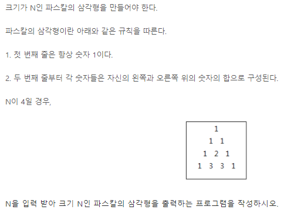

# Algorithm 문제 풀이 및 정리

> 첫 알고리즘 수업 시간에 느꼈던 점은 너무 너무 어렵다,,그저 어렵다,,였다. 문제를 풀기 위한 알고리즘을 생각하는 것도 부족하고 배웠던 Python 문법을 적용시켜 구현하는 것은 더욱 어려웠다.

> 때문에!!!! Algorithm 수업 시간에 배운 이론 내용과 풀었던 문제를 다시 정리하고 swea 문제들을 풀어보며 내 것으로 만들기위해 레포지를 만들었다!!

> 문제를 못 풀수도 있고 풀었다하더라도 코드의 길이가 길고 실행시간이 오래 걸리는 등 아직 많이 부족하기 때문에 두번, 세번 풀어보며 코드를 간소화해보자.

> 또한, 함께 수업을 듣는 사람들과 소통하며 다양한 코드 구현 방식을 익혀보자! 화이팅!! 😊😊


> ▶ 사용할 언어: Python 
>
> ▶ SW 역량테스트 IM 도저언!
>
> ▶ 1일 1 커밋하기!
>
> ▶ SWEA : 문제 난이도 > swea_문제번호 
>
> ▶ Algorithm: 난이도 > 문제 유형 > 문제번호_문제제목


---


[toc]

---


## SWEA

### D1


### D2

- **swea_1966 (숫자를 정렬하자)**

주어진 N의 길이의 숫자열을 오름차순으로 정렬하여 출력하는 문제.

수업시간에 배웠던 선택정렬을 사용!

```python
T = int(input())
for tc in range(1, T+1):
    N = int(input())
    lst = list(map(int, input().split()))
    for i in range(N): # 주어진 N의 범위만큼 순회
        min = i # i가 0부터 시작하므로 최솟값을 찾기 위한 인덱스 min을 i로 설정
        for j in range(i+1, N): # 0 다음인 1 인덱스부터 차례대로 순회
            if lst[min] > lst[j]: # 0번째 값보다 작은 인덱스 값(j)이 나온다면
                min = j # 최소 인덱스 값을 j로 바꿔준다.
        lst[i], lst[min] = lst[min], lst[i] # 현재 인덱스와 최소 인덱스 자리를 swap!
    
    print('#{}'.format(tc), end=' ')
    for i in lst: 
        print(i, end=' ')
    print()
```


- **swea_1948 (날짜 계산기)**

월 일로 이루어진 날짜를 2개 입력 받아, 두 번째 날짜가 첫 번째 날짜의 며칠째인지 출력하는 문제.

나는 날짜 계산법의 정석대로 그냥 풀었다..

```python
T = int(input())
for tc in range(1, T+1):

    lst = list(map(int, input().split())) # 3 22 5 10
	# 각 월마다 날짜 수를 리스트로 만들어준다.
    # 3월 22일에서 5월 10일까지의 날짜를 계산하려면
    # 3월 22일~3월 31일/ 4월 / 5월 1일~5월 10일의 일 수를 다 더해준다.
    num = [31, 28, 31, 30, 31, 30, 31, 31, 30, 31, 30, 31]
    total = 0
    # 먼저 통으로 계산되는 월을 구해서 total에 더해주고 (4월)
    for i in num[lst[0]:lst[2]-1]:
        total += i
	# 두 날짜의 월이 같다면 두 날짜의 일을 뺀 값을 더해주고
    if lst[0] == lst[2]:
        total += (lst[3] - lst[1])
    # 같지않다면
    # 첫번째 날짜의 경우, 해당 월의 총 일수에서 현 날짜를 빼준다(첫번째 날짜가 3월 22일이라면       3월의 총 일수인 31에서 현 일수인 22일을 빼 8이 얻어진다.)
    # 두번째 날짜의 경우, 그냥 현 일수인 lst[3]의 값을 더해주면 된다.(5월 10일이라면 그냥         10만 더해준다.)
    else: 
        total += (num[lst[0]-1] - lst[1]) + lst[3]
        #두번째 날짜가 첫번째 날짜의 며칠째인지 묻고 있으므로 총 total에 1을 더해준다.
    print('#{} {}'.format(tc, total+1))
```


- **swea_1961 (숫자 배열 회전)**

N x N 행렬이 주어질 때,

시계 방향으로 90도, 180도, 270도 회전한 모양을 출력하는 문제.

나는 행 순서가 아니라 열 순서대로 숫자들을 거꾸로 새로운 리스트에 담는 방법을 사용했다.


만일 N이 3이라면,

new_arr = [ 

[arr[2] [0], arr[1] [0], arr[0] [0]], 

[arr[2] [1], arr[1] [1], arr[0] [1]], 

[arr[2] [2], arr[1] [2], arr[0] [2]]

]


이렇게 일일이 하니 시간이 너무 오래 걸렸고 코드가 엄청 길어졌다..

코드를 줄이는 방법을 다시 생각해야겠다,,

```python
T = int(input())
for tc in range(1, T+1):
    N = int(input())
    arr = [list(map(int, input().split())) for _ in range(N)]

    new_lst = []
    for i in range(0, len(arr)):
        lst = []
        for j in range(0, len(arr)):
            lst.append(arr[j][i])
            
        new_lst.append(lst)
        
    num_list = []
    for i in new_lst:
        num_list.append(i[::-1])

    new_lst2 = []
    for k in range(0, N):
        lst2 = []
        for l in range(0, N):
            lst2.append(num_list[l][k])
        new_lst2.append(lst2)

    num_list2 = []
    for i in new_lst2:
        num_list2.append(i[::-1])
        num_list.append(i[::-1])

    new_lst3 = []
    for k in range(0, N):
        lst3 = []
        for l in range(0, N):
            lst3.append(num_list2[l][k])
        new_lst3.append(lst3)

    num_list3 = []
    for i in new_lst3:
        num_list3.append(i[::-1])
        num_list.append(i[::-1])

    print('#{}'.format(tc))
    for i in range(0, N):
        for j in num_list[i:len(num_list):N]:
            j.append(" ")
            for k in j:
                print(k, end='')
        print()
```


- **swea_1979 (어디에 단어가 들어갈 수 있을까)**

처음엔 행과 열 모두 체크하면서 연속된 1의 값을 cnt로 체크해주고 cnt가 K-1번 나왔다면 result에 +1을 해주자! 라고 생각하고 코드를 짰다.

```python
N, K = map(int, input().split())
arr = [list(map(int, input().split())) for _ in range(N)]

result = 0
# 행 체크
for i in range(0, N):
    cnt = 0
    for j in range(0, N-1):
        if arr[i][j] == 0:
            continue
        else:
            if arr[i][j] == arr[i][j+1]:
                cnt += 1
if cnt == K-1:
    result += 1
# 열 체크
for i in range(0, N-1):
    cnt1 = 0
    for j in range(0, N):
        if arr[j][i] == 0:
            continue
        if arr[j][i] == arr[j][i+1]:
            cnt1 += 1
if cnt1 == K-1:
    result += 1
print(result)
```

여기서 가장 쉽게 발견할 수 있었던 오류는 cnt와 K-1의 if문의 들여쓰기 였다.

그래서 일일이 if문 들여쓰기를 해보았다.


```python
N, K = map(int, input().split())
arr = [list(map(int, input().split())) for _ in range(N)]

result = 0

for i in range(0, N):
    cnt = 0
    for j in range(0, N-1):
        if arr[i][j] == 0:
            cnt = 0
            continue
        if arr[i][j] == arr[i][j+1]:
            cnt += 1
    if cnt == K-1:
    	result += 1
                
for i in range(0, N-1):
    cnt1 = 0
    for j in range(0, N):
        if arr[j][i] == 0:
            cnt1 = 0
            continue         
        if arr[j][i] == arr[j][i+1]:
            cnt1 += 1
    if cnt1 == K-1:
    	result += 1

print(result)
```

연속된 값으로 찾으려고 했는데 답이 안나와서 그냥 요소가 1인것들을 세기로 했다.

```python
N, K = map(int, input().split())
arr = [list(map(int, input().split())) for _ in range(N)]

result = 0
for i in range(0, N):
    cnt = 0
    for j in range(0, N):
        if arr[i][j] == 0:
            cnt = 0
            continue
        if arr[i][j] == 1:
            cnt += 1
    if cnt == K:
        result += 1    

for i in range(0, N):
	cnt1 = 0
	for j in range(0, N):
		if arr[j][i] == 0:
			cnt1 = 0
			continue
		if arr[j][i] == 1:
			cnt1 += 1
	if cnt1 == K:
		result += 1
```

이렇게 하면 행 또는 열 안에 1이 연속되게 K번 나온 후 0이 나온다면 cnt를 0으로 초기화했기 때문에 값이 나오지 않았다. 그래서 요소가 0일 때도 cnt가 K와 같은지 확인해야 한다!

> 최종코드

```python
import sys
sys.stdin = open('input_1979.txt')

T = int(input())
for tc in range(1, T+1):

    N, K = map(int, input().split())
    arr = [list(map(int, input().split())) for _ in range(N)]

    result = 0
    # cnt = 0
    for i in range(0, N):
        cnt = 0
        for j in range(0, N):
            if arr[i][j] == 0:
                if cnt == K:
                    result += 1
                cnt = 0
                continue
            else:
                cnt += 1
        if cnt == K:
            result += 1

    for i in range(0, N):
        cnt = 0
        for j in range(0, N):
            if arr[j][i] == 0:
                if cnt == K:
                    result += 1
                cnt = 0
                continue
            else:
                cnt += 1
        if cnt == K:
            result += 1

    print('#{} {}'.format(tc, result))
```


- **swea_1976 (시각 덧셈)**

시 분으로 이루어진 시각을 2개 입력 받아, 더한 값을 시 분으로 출력하는 문제.

```python
T = int(input())
for tc in range(1, T+1):

    lst = list(map(int, input().split()))

	# 시 끼리 먼저 더해주고 더한 값이 12보다 크면 값에서 12를 빼준다.
    if lst[0] + lst[2] > 12:
        h = (lst[0] + lst[2]) - 12

    else:
        h = lst[0] + lst[2]
	# 분 끼리 더해주고 더한 값이 60보다 크면 값에서 60을 빼주고 시에 + 1를 해준다.
    if lst[1] + lst[3] > 60:
        h += 1
        m = (lst[1] + lst[3]) - 60

    else:
        m = lst[1] + lst[3]

    print('#{} {} {}'.format(tc,h, m))
```


- **swea_1954 (달팽이 숫자)**

1부터 N*N 까지의 숫자를 시계방향으로 이루어진 달팽이 모양으로 출력하는 문제.

```python
T = int(input())
for tc in range(1, T+1):

    # lst에서 최소값을 구한다.
    def getMin(curV):
        minV = 1000
        for i in lst:
            if minV > i and i > curV:
                minV = i
        return minV

    # 벽을 만났을 때,
    def isWall(x, y):
        if x >= N or x < 0:
            return True
        if y >= N or y < 0:
            return True
        if arr[y][x] != 0:
            return True
        return False

    N = int(input())
    lst = list(range(1, N**2+1))
    arr = [[0] * N for _ in range(N)]
    
	# 방향 설정
    dx = [1, 0, -1, 0]
    dy = [0, 1, 0, -1]
    dir = 0

    # 현재 위치 설정
    curX = curY = 0
    curV = 0
	
    for i in range(1, N**2+1):
        val = getMin(curV)
        arr[curY][curX] = val
        testX = curX + dx[dir]
        testY = curY + dy[dir]
        if isWall(testX, testY):
            dir += 1
            if dir == 4:
                dir = 0

        curX = curX + dx[dir]
        curY = curY + dy[dir]
        curV = val

    print('#{}'.format(tc))
    for i in range(len(arr)):
        for j in range(len(arr)):
            print(arr[i][j], end=" ")
        print()
```


- **swea_2005 (파스칼의 삼각형)**



```python
T = int(input())
for tc in range(1, T+1):
    
    N = int(input())
    # N행의 빈 2차원 리스트를 만들어준다.
    arr = [ [] for _ in range(N)]

    # 1행은 [1] 2행은 [1, 1]을 먼저 넣어준다.
    arr[0].append(1)
    if len(arr) > 1:
        arr[1].append(1)
        arr[1].append(1)

	# 2행부터 순회하며 연속된 두개의 값을 더해 그 다음 행에 넣어주고,
    for i in range(1, N-1):
        for j in range(0, len(arr[i])-1):
            x = arr[i][j] + arr[i][j+1]
            arr[i+1].append(x)
        # 행의 앞, 뒤로 1를 넣어준다.
        arr[i+1].insert(0, 1)
        arr[i+1].insert(len(arr[i+1]), 1)

    print('#{}'.format(tc))
    for i in range(N):
        for j in range(0, len(arr[i])):
            print(arr[i][j], end=" ")
        print()
```


- **swea_1970 (쉬운 거스름돈)**

```python
T = int(input())
for tc in range(1, T+1):
    N = int(input())
    lst = [50000, 10000, 5000, 1000, 500, 100, 50, 10]

    print('#{}'.format(tc))
    cnt = 0
    for i in lst:
        cnt = N // i
        print(cnt,end=" ")
        N = N - (i*cnt)
    print()
```


- **swea_1926 (간단한 369게임)**


### D3


---


## Algorithm

### 이론

> **string**

- **문자열 뒤집기 (연습문제 1)**

  python은 reverse함수 혹은 silce notation을 이용하여 구현하면 된다.

  string은 immutable이기 때문에 swap이 가능하지 않다.

  그렇기때문에 string을 list로 변환해주어야 한다!

  ```python
  def word_reverse(word):
      # str -> list
      arr = list(word)
      # swap
      for i in range(len(arr)//2):
         arr[i], arr[len(arr)-1-i] = arr[len(arr)-1-i], arr[i]
      # list -> str
      word = "".join(arr)
      return word
  
  
  word = 'algorithm'
  word1 = word_reverse(word)
  print(word1)
  ```

  ```python
  # [::-1] 이용
  word = 'algorithm'
  print(word[::-1])
  ```

  ```python
  # reverse() 이용
  word = 'algorithm'
  arr = list(word)
  arr.reverse()
  arr = "".join(arr)
  print(arr)
  ```


- **문자열 비교 (string compare)**

```python
def strcmp(s1, s2):
    if len(s1) != len(s2):
        return False
    else:
        i = 0 # 초기식
        while i < len(s1) and i < len(s2): # 조건식
            if s1[i] != s2[i]:
                return False
            i += 1 # 증감식
        return True

a = 'abc'
b = 'abc'
print(strcmp(a, b)) # True, False
```


- **문자열 숫자를 정수로 변환 ( atoi() )** 

```python
def atoi(word):
    value = 0
    for i in range(len(word)):
        c = word[i]
        # 0 ~ 9
        # if c >= '0' and c <= '9':
        if '0' <= c <= '9':
            # ord(c) = 49, ord('o') = 48
            digit = ord(c) - ord('0')
        else:
            break
            # value = 0 * 10 + 1 -> 1
            # value = 1 * 10 + 2 -> 12
            # value = 12 * 10 + 3 -> 123
        value = value * 10 + digit
    return value

a = '123'
print(type(a))
b = atoi(a)
print(type(b))
```


- **정수를 문자열로 변환 ( itoa() )** 

```python
def itoa(num):
    x = num # 몫
    y = 0  # 나머지가 들어갈 변수
    arr = []
    while x:
        y = x % 10
        x = x // 10
        # arr = [3, 2, 1]
        arr.append(chr(y + ord('0')))
    # arr = [1, 2, 3]
    arr.reverse()
    # list -> str로 변환
    str = ''.join(arr)
    return str

x = 123
print(x, type(x))
str = itoa(x)
print(str, type(str))
```


- **패턴매칭**

  - 고직식한 알고리즘(Brute Force): 본문 문자열을 처음부터 끝까지 차례대로 순회하면서 패턴 내의 문자들을 일일이 비교하는 방식으로 동작

  ```python
  def BruteForce(p, t):
      i = 0
      j = 0
      while j < M and i < N:
          if t[i] != p[j]:
              i = i - j
              j = -1
          i = i + 1
          j = j + 1
      if j == M:
          return i - M
      else:
          return -1
  
  p = 'is'
  t = 'This is a book~!'
  M = len(p)
  N = len(t)
  print(BruteForce(p, t))
  ```

  

  

### Intermediate

- **[S/W 문제해결 기본] 5일차 - GNS**

  ```python
  T = int(input())
  for tc in range(1, T+1):
      print('#{}'.format(tc))
      N = input() # 실제 사용은 하지 않는다.
      word = input().split()
      word_list = ["ZRO", "ONE", "TWO", "THR", "FOR", "FIV", "SIX", "SVN", "EGT", "NIN"]
  
      # word_list의 값들이 0~9의 값을 가지도록 딕셔너리 형태로 만들어준다.
      # {'ZRO': 0, 'ONE': 1, 'TWO': 2, 'THR': 3, 'FOR': 4, 'FIV': 5, 'SIX': 6, 'SVN': 7, 'EGT': 8, 'NIN': 9}
      result = {}
      cnt = 0
      for i in word_list:
          if i == "ZRO":
              cnt = 0
          else:
              cnt += 1
          result[i] = cnt
  
      # input값을 오름차순으로 정렬시키기 위해 .get()을 이용하여 value값만 담은 리스트를 만들었다.
      new = []
      for i in word:
          new.append(result.get(i))
          new = sorted(new)
  
      # 정렬된 value값들을 순회하면서,
      # result의 value값과 같다면 key를 출력하도록 하였다.
      key_lst = []
      for num in new:
          for key, value in result.items():
              if value == num:
                  key_lst.append(key)
  
      for i in key_lst:
          print(i, end=" ")
      print()
  ```

  #

  ```python
  arr = ["ZRO", "ONE", "TWO", "THR", "FOR", "FIV", "SIX", "SVN", "EGT", "NIN"]
  T = int(input())
  for tc in range(1, T+1):
      print('#{}'.format(tc))
      No, N = input().split()
      s = input().split()
      # 1번째 방법
      # arr을 순회하면서 값이 s에 있으면 출력하면 된다.
      for chk in arr:
          for j in s:
              if chk == j:
                  print(j, end=" ")
      print()
  ```

  #
  
  ```python
  arr = ["ZRO", "ONE", "TWO", "THR", "FOR", "FIV", "SIX", "SVN", "EGT", "NIN"]
  T = int(input())
  for tc in range(1, T+1):
      print('#{}'.format(tc))
      No, N = input().split()
      s = input().split()
      # 2번째 방법
      # arr을 순회하면서 s에 몇개있는지 count를 센 후, count만큼 출력한다.
      for i in arr:
          print((i+' ')*s.count(i), end=" ")
  ```


- **[S/W 문제해결 기본] 3일차 - 회문**

```python
'''
100 * 100 table에서 행과 열에서 가장 긴 회문을 찾고 회문의 길이를 출력하는 문제.
회문의 길이가 정해져있지않아 1개부터 100개가지 반복을 돌며 회문을 찾고,
딕셔너리에 key에는 회문을 value에는 회문의 길이를 넣어
value값만 순회하며 최댓값을 찾아냈다.
'''

T = 10
for tc in range(1, T+1):
    print('#{}'.format(tc), end=" ")

    number = int(input())
    arr = list(input() for _ in range(100))
    # 회문과 회문의 길이를 담을 딕셔너리를 만든다.
    result = {}

    # 행 탐색
    # 100 * 100 table이기 때문에 범위를 100으로 주면서 완전탐색한다.
    for i in range(100):
        for j in range(100):
            # 회문의 길이가 1부터 100까지 가능하기때문에 슬라이싱 범위에 사용될 k를 2~101까지 반복을 돌린다.
            for k in range(2, 102):
                # i = 0, j = 0, k = 2라면,
                # arr[0][0:2]까지 슬라이싱한 후 회문인지 판단한다.(k=2 -> 회문의 길이 == 1)
                if arr[i][j:j+k] == arr[i][j:j+k][::-1]:
                    # 회문이라면, 회문의 길이를 구하고
                    length = len(arr[i][j:j+k])
                    # result에 key=회문, value=회문 길이로 넣어준다.
                    result[arr[i][j:j+k]] = length
    # 열 탐색
    # 열은 슬라이싱을 사용할 수 없다.
    # 그러므로 열 값을 따로 담은 리스트를 새로 만들자.

    # 2차원 리스트 변수를 만든다.
    column = []
    # 완전탐색으로 열을 c_lst에 담는다.
    for i in range(100):
        c_lst = []
        for j in range(100):
            c_lst.append(arr[j][i])
        # c_lst를 column리스트에 담아준다.
        # [ [""], [""], [""].... ]
        column.append(c_lst)
    
    # 행과 같은 방법으로 회문을 찾는다.
    for i in range(100):
        for j in range(100):
            for k in range(2, 102):
                if column[i][j:j+k] == column[i][j:j+k][::-1]:
                    length = len(column[i][j:j+k])
                    result["".join(column[i][j:j+k])] = length
    # result의 value 값을 순회하면서 초댓값을 찾아준다.
    max_value = 0
    for key, value in result.items():
        if max_value < value:
            max_value = value
    # 최댓값을 출력한다.
    print(max_value)
```


- **swea_4861 (회문)**

```python
'''
N * N table에서 길이가 M인 회문을 찾는 문제
여기서 주의할 점은 N과 M이 같지않을때,
만약 10 * 10 table에서 길이가 5인 회문이라면
['ABCDEFGHIJ']에서 시작점의 범위는 'A'~'F'까지만 확인하면 된다.!
-> 범위를 N-M+1로 주어야 한다.!
'''
T = int(input())
for tc in range(1, T+1):
    print('#{}'.format(tc), end=" ")
    N, M = map(int, input().split())
    arr = list(input() for _ in range(N))

    # 행 체크
    for i in range(N):
        for j in range(N-M+1):
            # 회문 길이만큼 슬라이싱해서 [::-1]과 같다면,
            if arr[i][j:j+M] == arr[i][j:j+M][::-1]:
                # 출력한다.
                print(arr[i][j:j+M])
    # 열 체크
    # 열 체크를 할 땐 슬라이싱을 사용할 수 없다.
    # 열을 그냥 새로운 리스트에 담아서 위와 같은 방법을 사용하자.

    # 2차원 배열을 담을 리스트를 만든다.
    colunm = []
    # 완전탐색을 이용하여 열 값을 lst리스트에 담아준다.
    for i in range(N):
        lst = []
        for j in range(N):
            lst.append(arr[j][i])
        # [ [""], [""], [""].... ]
        colunm.append(lst)

    # 행 체크 방법과 동일하게 적용한다.
    for i in range(N):
        for j in range(N-M+1):
            if colunm[i][j:j+M] == colunm[i][j:j+M][::-1]:
                # 리스트이기때문에 str로 변환해서 출력해야 한다!
                print("".join(colunm[i][j:j+M]))
```


- **swea_4864 (문자열 비교)**

```python
T = int(input())
for tc in range(1, T+1):

    def BruteForce(p, t):
        i = 0
        j = 0
        while j < M and i < N:
            if str2[i] != str1[j]:
                i = i - j
                j = -1

            i = i + 1
            j = j + 1
        if j == M:
            return 1
        else:
            return 0

    str1 = input()
    str2 = input()
    M = len(str1)
    N = len(str2)
    print('#{} {}'.format(tc, BruteForce(str1, str2)))
```


#

```python
P = input()
T = input()
# pp하고 tp 초기화
pp = 0
tp = 0
found = False # while 빠져나갈 때
# while 못찾은 동안 and tp가 범위내에 있는 경우:
while not found and tp < len(P)-len(T) + 1:
    if P[pp] == T[tp]:
        pp += 1
        tp += 1
        if pp == len(P):
        # if  pp가 마지막에 오면:
            found = True # 찾음
    else:
        pp = 0
        tp = tp - pp + 1

if found==True:
    print('1')
else:
    print('0')
```


- **swea_4865 (글자수)**

```python
T = int(input())
for tc in  range(1, T+1):
    str1 = input()
    str2 = input()

    # str1이 str2에 몇개씩 들어가있는지 확인하기위해 딕셔너리를 사용한다.
    result = {}
    # str1의 문자를 key로 만들고 str2에 나온 횟수를 value로 만든다.
    # str1의 key를 순회하면서,
    for i in str1:
        cnt = 0
        # str2를 순회하면서 key를 비교한다.
        for j in str2:
        # str2의 key값과 같다면(str1의 key가 str2에 들어있다면)
            if i == j:
                # key에 해당하는 value값을 1씩 증가시킨다.
                cnt += 1
                # result 넣어준다.
                result[i] = cnt
    # 최댓값을 초기화시켜놓고,
    max_value = 0
    # result의 value 값들만 순회하면서
    for i in result.values():
        # 최댓값을 구해준다.
        if i > max_value:
            max_value = i
    # value의 최댓값을 출력한다.
    print('#{} {}'.format(tc, max_value))
```


### Advanced
